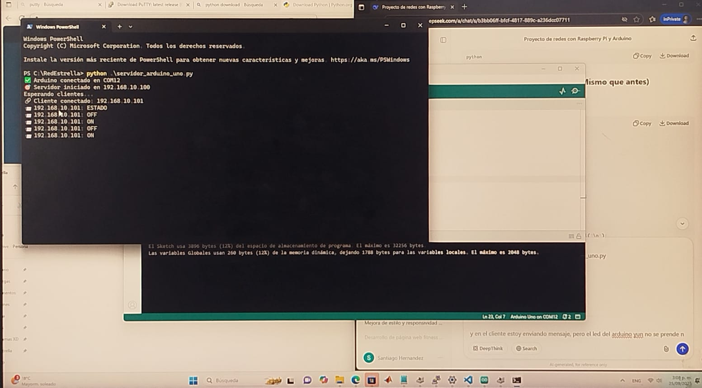
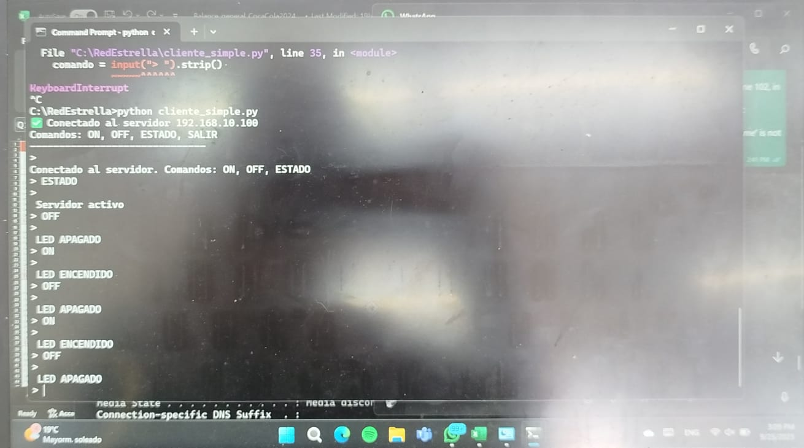
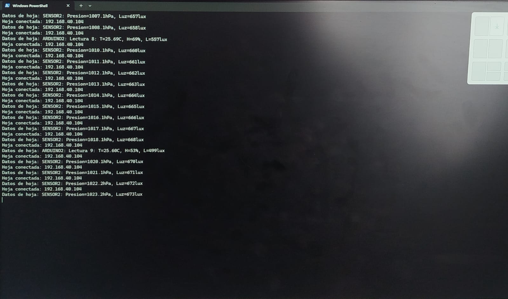
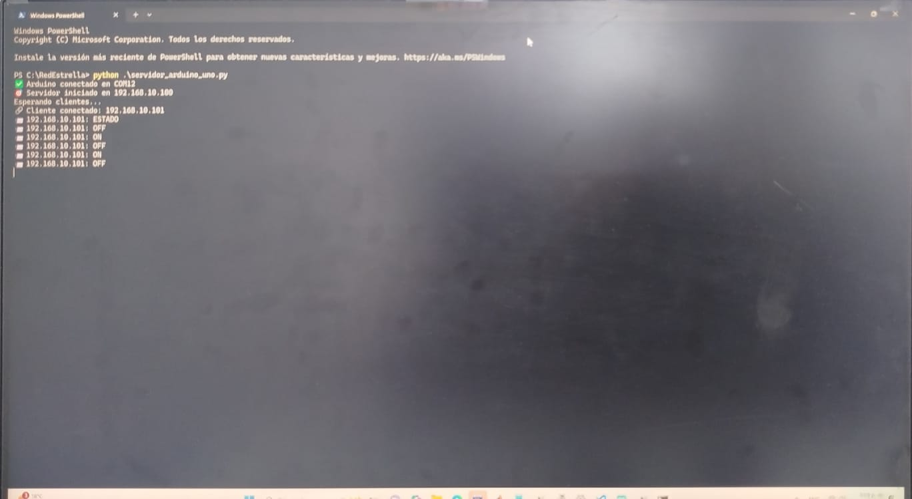
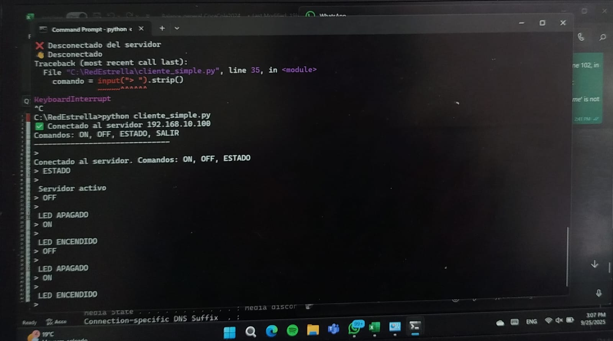
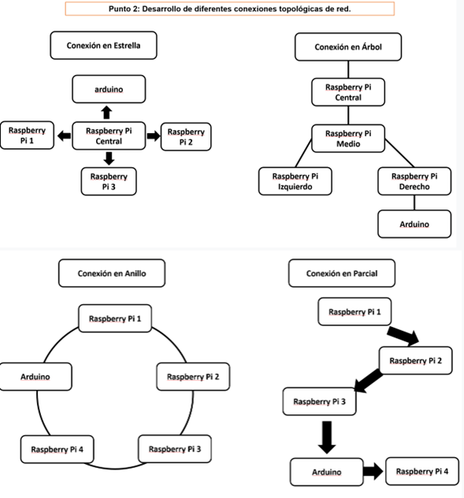

# Laboratorio 3 – Configuración de Switch y Topologías de Red

**Universidad Santo Tomás**  
**Asignatura:** Comunicaciones Industriales  
**Santiago Hernández Ávila**  
**Diego Alejandro Rodriguez Guzmán**  
**Camila Perez Mercado**  
**Carrera:** Ingeniería Electrónica  

---

## Objetivo General

Configurar un switch básico (24/48 puertos) existente en la Universidad Santo Tomás y desarrollar diferentes topologías de red (estrella, árbol, anillo y malla) utilizando Raspberry Pi y Arduino, con el fin de analizar su comportamiento y la comunicación entre dispositivos.

---

## Punto 1: Conociendo el switch y la red interna

### Actividades realizadas

- Se estableció la conexión con el switch utilizando PuTTY mediante protocolo Telnet/SSH.  
- Se exploró la información almacenada en NVRAM, como:
  - Dirección MAC del dispositivo.  
  - Tabla ARP.  
  - Versión del sistema y usuarios conectados.  
- Se configuraron interfaces VLAN con las siguientes máscaras:
  - VLAN 1 → Máscara /24  
  - VLAN 2 → Máscara /16  
  - VLAN 3 → Máscara /8  
- Se crearon usuarios y se configuraron puertos en modo troncal y acceso.  
- Se verificó la velocidad de enlace de cada interfaz.  
- Se conectaron los siguientes dispositivos:
  - PC del laboratorio (ETM)  
  - Portátil personal  
  - Raspberry Pi  
  Se comprobó la conectividad entre ellos mediante ping y visualización en la tabla ARP.

### Diagrama de conexión

---

## Punto 2: Desarrollo de las topologías de red

Se implementaron y probaron cuatro tipos de topologías utilizando Raspberry Pi y Arduino.  
Cada topología incluye un script en Python con la lógica de comunicación y control.

---

### Topología Estrella

**Archivo:** `estrella.py`

**Descripción:**  
En esta topología existe un nodo central que actúa como servidor.  
Los demás nodos (Raspberry o Arduino) se conectan al servidor por medio de sockets TCP.  
Cada cliente puede enviar los siguientes comandos:
- ON: Encender el LED.  
- OFF: Apagar el LED.  
- ESTADO: Consultar el estado.  
- SALIR: Finalizar la conexión.

**Objetivo:**  
Permitir el control del LED desde cualquier nodo, garantizando que todos mantengan el mismo estado.

**Evidencia de funcionamiento - Servidor:**  

**Evidencia de funcionamiento - Cliente:**  

---

### Topología Árbol

**Archivo:** `arbol.py`

**Descripción:**  
Un nodo raíz recibe los datos provenientes de los nodos intermedios.  
Cada nodo intermedio reenvía la información que recibe de los nodos hoja hacia el nodo raíz.  
Se utiliza comunicación cliente-servidor encadenada.

**Objetivo:**  
Transmitir la información de los nodos hoja (por ejemplo, datos de sensores) hacia un nodo central.

**Evidencia de datos de sensores:**  

---

### Topología Malla

**Archivo:** `malla.py`

**Descripción:**  
Cada nodo se conecta con varios vecinos, formando enlaces redundantes.  
Se implementa detección de nodos caídos, reenvío de mensajes y monitoreo del estado de conexión.  
Un nodo (PC3) tiene conectado un Arduino para realizar pruebas de control.

**Objetivo:**  
Simular una red tolerante a fallos en la que los nodos puedan seguir comunicándose incluso si uno de los enlaces falla.

**Evidencia de monitoreo de sensores:**  

---

### Topología Anillo

**Archivo:** `anillo.py`

**Descripción:**  
Los nodos se conectan de manera circular, formando anillo lógico.  
Se implementa el paso de token, donde solo el nodo que posee el token puede enviar información.  
El nodo PC3 controla un Arduino, y solo puede hacerlo cuando tiene el token.

**Objetivo:**  
Simular el control de acceso al medio mediante token passing y la comunicación secuencial entre nodos.

**Evidencia de servidor en ejecución:**  

---

### Funcionalidades generales implementadas

- Comunicación por sockets TCP/IP.  
- Identificación de nodos con dirección IP estática.  
- Uso de hilos (threads) para envío y recepción simultánea.  
- Simulación de caídas de red y recuperación.  
- Control de Arduino (encendido y apagado de LED) desde la red.

---

## Pruebas y verificación

1. Se verificó la conectividad entre todos los nodos mediante ping.  
2. En cada topología se comprobó:
   - Comunicación bidireccional.  
   - Recepción simultánea de mensajes.  
   - Reenvío correcto de datos.  
3. En la topología de anillo:
   - Solo el nodo con el token pudo comunicarse con el Arduino.  
4. En la topología malla:
   - Se simularon caídas de nodos y la red siguió operativa.

**Evidencia de control de LED:**  

---

Cada script incluye comentarios explicativos y está organizado por funciones y clases.  
Este documento describe el desarrollo completo del laboratorio.

---

## Conclusiones

- Se comprendió la estructura interna y configuración básica de un switch.  
- Se analizaron las principales topologías de red y su comportamiento.  
- Se logró la integración de Raspberry Pi y Arduino en un entorno de red local.  
- Se aplicaron conceptos de comunicación, token, enrutamiento y tolerancia a fallos.  

---

## Diagramas de topologías

### Estrella, Árbol, Anillo y Malla

---

## Autores

**Santiago Hernández Ávila**  
**Diego Alejandro Rodriguez Guzmán**  
**Camila Perez Mercado**  
Facultad de Ingeniería Electrónica  
Universidad Santo Tomás  
2025

